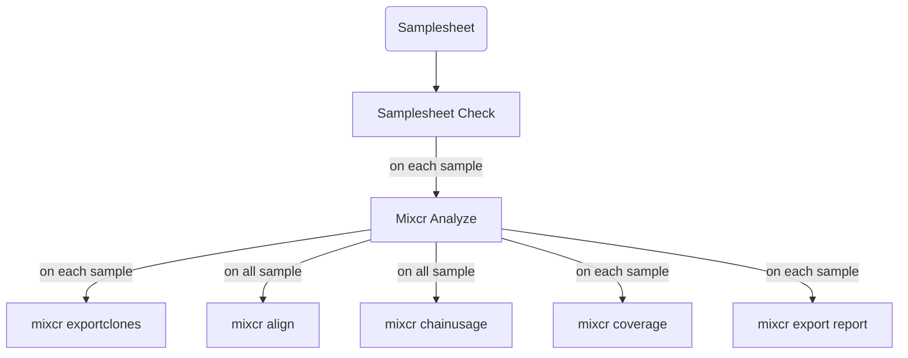

# nf-mixcr: TCR repertoire building with MiCXR

nf-mixcr is nextflow pipeline running mixcr to build T-cell repertoire from illumina sequencing.
Nextflow makes your life easier by managing for you the input files, output files and jobs for you without having to install any program apart Nextflow itself.

The pipeline run the `mixcr analyze` program on all reads files placed in an input directory and the generates the QC and clones tables automatically.




## Requirements
**NB:** I assume you have a minimal knowledge of terminal and bash and you'll be able to run the following lines.

nf-mixcr analyze does not require lot of dependencies to run.
If you plan running it on a cluster (like Eddie), there's big chances you do not need install anything.
The only dependencies are: 
- [Nextflow](https://www.nextflow.io/)
- [Docker](https://docs.docker.com/get-docker/) or [Singularity](https://sylabs.io/singularity/)
- [MixCr](https://mixcr.com/) (for only for activation!)

My advise to install those is to use the package manager [conda (Miniforge)](https://github.com/conda-forge/miniforge).
```
conda create -n nf-mixcr_env
conda activate nf-mixcr_env
conda install -c milaboratories nextflow singularity mixcr
```

### MiXCR (once for licence activation)
Before going futher, you will need a licence for using `mixcr`. 
If you don't have one, please visit this [page](https://mixcr.com/mixcr/getting-started/milm/) and fill in the form.
If your an academic, lucky you, it's free! If you're not, please check the commercial licensing page.
Once you received your licence, please run the command `mixcr activate-license` and copy paste your licence key.


## Pipeline Installation

**NOPE!** 🎉

But first, let's check if the pipeline is running correctly.
It use profiles to set a series of parameters.
The test profile can be use to run to the pipeline with toy dataset automatically downloaded from the repository.

You start the test by running:
```
nextflow run sguizard/nf-mixcr -profile singularity,test
```

or if you use docker in place of singularity:

```
nextflow run sguizard/nf-mixcr -profile docker,test
```


## Preparing files and data for analysis
To keep files sorted between inputs, outputs and working directories, I start by create a directory for the analysis (TCR_project) and create a data directory where I store the reads and other inputs files:

```
TCR_project/
└── data
    ├── imgt.202312-3.sv8.json.gz
    ├── mixcr_analyze.config
    ├── read_1.fastq.gz
    ├── read_2.fastq.gz
    └── samplesheet.csv
```

### Samplesheet
A sampleesheet must be provided. This file is a three columns comma separated value table. The columns are `id`, `read1`, `read2` and each value must be separated by a comma. Each line gives the location of the fastq file associated with a uniq ID.
```
id,read1,read2
SAMP1,./data/read_1.fastq.gz,./data/read_2.fastq.gz
```

### Library (Optional)
If the specie studied is different from Human (hsa) or Mouse (mmu), you'll need to provide a library of reference V, D, J, C genes. The [IMGT](https://www.imgt.org/) provides libraries for a large panel of specie which can be used with mixcr. The data can be downloaded [here](https://github.com/repseqio/library-imgt/releases). Please, don't decompress the file and keep the **`'.json.gz'`** extension.

### mixcr analyze configuration file
Mixcr gather multiple tools and each of them are highly configurable. Implementing all mixcr options in the pipeline would be highly time consuming. As a tradeoff, I decided to make use of a configuration file to set up mixcr analyze parameters. You can find a template configuration file [here](https://github.com/sguizard/nf-mixcr/blob/0ef8ed865293ea6643b31865ab1963757a74cb34/configs/mixcr_analyze_template.config), modify it with your needs.


Each lines between the central square brackets is a mixcr analyze option. If needed, you can add options by inserting a new line at the end of the option, write your option between **simple quotes** and ending the line with a **comma**.
```
process {
    withName: MIXCR_ANALYZE {
        cpus = 8
        ext.args = {
            [
                '--species cat',
                '--rna',
                '--tag-pattern "^N{4:6}GCTCACCTTTTTCAGGTCCTC(R1:*)\\^N{4:6}GCAGTGGTATCAACGCAGAGT(UMI:TN{4}TN{4}TN{4}TCTTGGGG)(R2:*)"',
                '--rigid-left-alignment-boundary',
                '--floating-right-alignment-boundary J',
            ].join(' ').trim()
        }
    }
}
```


## Running the pipeline

The classical command line to run the pipeline looks like this:
```
nextflow run sguizard/nf-mixcr -profile <singularity/docker/eddie> -c data/mixcr_analyze.config --samplesheet data/samplesheet.csv --preset generic-amplicon-with-umi
```

### Options description
You will set two kind of options:
- Nextflow options, with simple dash (eg. `-profile`)
- Pipeline options, with double dash (eg. `--samplesheet`)

The nextflow options that need to be used are:
- `-profile`: select the adhoc virtualization technology (docker or singularity) and the profile of your cluster (eg. eddie). Profiles are separated by commas (eg. docker,eddie). (**MANDATORY**)
- ` -c`: define additional configuration. Please add the mandatory `mixcr_analyze.config` file here. (**MANDATORY**)

The pipeline options are: 
- `--samplesheet`: The path to the samplesheet listing samples as describe above (**MANDATORY**)
- `--preset`: mixcr analyze preset to use. (eg. `generic-amplicon-with-umi`) (**MANDATORY**)
- `--library`: V, D, J, C reference genes library
- `--study`: An ID that will be used as prefix for global report files


## Output files

TODO: Write output files
