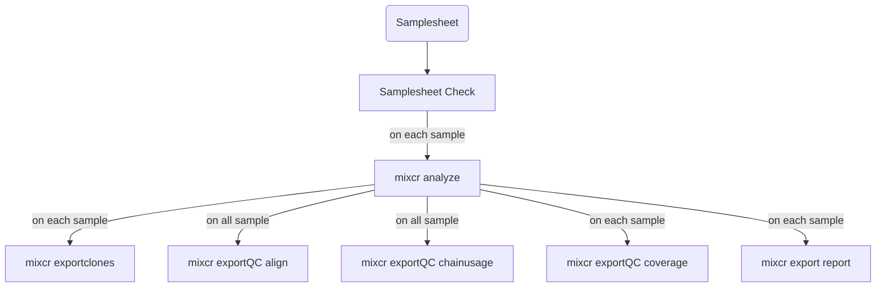

# nf-mixcr: TCR repertoire building with MiXCR
[](https://zenodo.org/doi/10.5281/zenodo.10678866)

`nf-mixcr` is nextflow pipeline running MiXCR to build T-cell repertoire from illumina sequencing.
Nextflow makes your life easier by managing for you the input files, output files and jobs without having to install any program apart Nextflow itself and a container runner (singularity or docker).

The pipeline runs the `mixcr analyze` program on each read pair placed listed in a samplesheet file, generates the QC and clones tables automatically.



Full list of run programs:

- [mixcr analyze](https://mixcr.com/mixcr/reference/mixcr-analyze/)
- [mixcr exportclones](https://mixcr.com/mixcr/reference/mixcr-export/)
- [mixcr exportQC align](https://mixcr.com/mixcr/reference/mixcr-exportQc/)
- [mixcr exportQC chainusage](https://mixcr.com/mixcr/reference/mixcr-exportQc/#chain-usage)
- [mixcr exportQC coverage](https://mixcr.com/mixcr/reference/mixcr-exportQc/#reads-coverage)
- [mixcr export report](https://mixcr.com/mixcr/reference/mixcr-export/)

## Requirements

**NB:** I assume you have a minimal knowledge of terminal and bash and you'll be able to run the following lines.

`nf-mixcr` does not require lots of dependencies to run.
If you plan to run it on a cluster (like Eddie), there are big chances you do not need to install anything.
The only dependencies are:

- [Nextflow](https://www.nextflow.io/)
- [Docker](https://docs.docker.com/get-docker/) or [Singularity](https://sylabs.io/singularity/)
- [MiXCR](https://mixcr.com/) (for activation only!)

My advice for installation is to use [conda (Miniforge)](https://github.com/conda-forge/miniforge) package manager.

```bash
conda create -n nf-mixcr_env
conda activate nf-mixcr_env
conda install -c milaboratories nextflow singularity mixcr
```

### MiXCR (once for licence activation)

Before going further, you will need a licence for using MiXCR.
If you don't have one, please visit this [page](https://mixcr.com/mixcr/getting-started/milm/) and fill in the form.
If you are an academic, lucky you, it's free! If you're not, please check the commercial licensing page.
Once you received your licence, please run the command `mixcr activate-license` and copy paste your license key.

## Pipeline Installation

**NOPE!** 🎉

But first, let's check if the pipeline is running correctly.
The test profile can be use to run to the pipeline with toy datasets automatically downloaded from the repository.

You can start the test by running:

```bash
nextflow run sguizard/nf-mixcr -profile singularity,test,<Institution>
```

or if you use docker in place of singularity:

```bash
nextflow run sguizard/nf-mixcr -profile docker,test,<Institution>
```

The <Institution> place holder must be replaced by your cluster profile. The list of available configs can be found on [nf-core website](https://nf-co.re/configs).

**NB:** `singularity` or `docker` profile might be skipped if they are already defined in your institution profile.

## Preparing files and data for analysis

To keep files sorted between inputs, outputs and working directories, I start by creating a directory for the analysis (TCR_project) and create a data directory where I store the reads and other inputs files:

```txt
TCR_project/
└── data
    ├── imgt.202312-3.sv8.json.gz
    ├── mixcr_analyze.config
    ├── read_1.fastq.gz
    ├── read_2.fastq.gz
    └── samplesheet.csv
```

### Samplesheet

A sampleesheet must be provided. This file is a three columns comma-separated value table. The columns are `id`, `read1`, `read2` and each value must be separated by a comma. Each line gives the location of the fastq file associated with a unique ID.

```csv
id,read1,read2
SAMP1,./data/read_1.fastq.gz,./data/read_2.fastq.gz
```

### Library (Optional)

If the specie studied is different from Human (hsa) or Mouse (mmu), you'll need to provide a library of reference V, D, J, C genes. The [IMGT](https://www.imgt.org/) provides libraries for a large panel of specie which can be used with mixcr. The data can be downloaded [here](https://github.com/repseqio/library-imgt/releases). Please, don't decompress the file and keep the **`'.json.gz'`** extension.

### mixcr analyze configuration file

MiXCR gather multiple tools and each of them are highly configurable. Implementing all MiXCR options in the pipeline would be highly time consuming. As a tradeoff, I decided to make use of a configuration file to set up `mixcr analyze` parameters. You can find a template configuration file [here](https://github.com/sguizard/nf-mixcr/blob/0ef8ed865293ea6643b31865ab1963757a74cb34/configs/mixcr_analyze_template.config), modify it with your needs. You can also run the pipeline with the option `--get_ma_conf` to get a copy.

Each line between the central square brackets is a `mixcr analyze` option. If needed, you can add options by inserting a new line at the end of the option, write your option between **simple quotes** and ending the line with a **comma**.

```txt
process {
    withName: MIXCR_ANALYZE {
        cpus = 8
        ext.args = {
            [
                '--species cat',
                '--rna',
                '--tag-pattern "^N{4:6}GCTCACCTTTTTCAGGTCCTC(R1:*)\\^N{4:6}GCAGTGGTATCAACGCAGAGT(UMI:TN{4}TN{4}TN{4}TCTTGGGG)(R2:*)"',
                '--rigid-left-alignment-boundary',
                '--floating-right-alignment-boundary J',
                '--ADDITIONAL-OPTION and_its_value',
            ].join(' ').trim()
        }
    }
}
```

## Running the pipeline

The classical command line to run the pipeline looks like this:

```bash
nextflow run sguizard/nf-mixcr \
    -profile <Institution> \
    -c data/mixcr_analyze.config \
    --samplesheet data/samplesheet.csv \
    --preset generic-amplicon-with-umi \
    --study My_project
```

### Options description

You will set two kind of options:

- Nextflow options, with simple dash (eg. `-profile`)
- Pipeline options, with double dash (eg. `--samplesheet`)

The nextflow options that need to be used are:

- `-profile`: select the adhoc virtualization technology (docker or singularity) and the profile of your cluster (eg. eddie). Profiles are separated by commas (eg. docker,eddie).
- ` -c`: define additional configuration. Please add the mandatory `mixcr_analyze.config` file here.

The pipeline options are:

- `--samplesheet`: The path to the samplesheet listing samples as describe above
- `--preset`: mixcr analyze preset to use. (eg. `generic-amplicon-with-umi`)
- `--library`: V, D, J, C reference genes library
- `--study`: An ID that will be used as prefix for global report files (**Default: TCR**)
- `--outdir`: the name of the directory where the results will be publish (**Default: results**)
- `--get_ma_conf`: Download a copy of template `mixcr_analysis.config` and stop

Some option must be defined for each run and can't be omitted.
The **compulsory** options are:

- `-profile`
- `-c` (mixcr_analysis.config)
- `--samplesheet`
- `--preset`

## Output files

The results of the pipeline will be stored in the directory defined by the `--outdir` option. For each process/program, one directory will be created to store the results. An additional directory, `pipeline_info`, gather reports about pipeline execution.

```txt
<outdir name>/
|-- 01_mixcr_analysis
|-- 02_mixcr_exportClones
|-- 03_mixcr_exportQc_align
|-- 03_mixcr_exportQc_chainusage
|-- 03_mixcr_exportQc_coverage
|-- 04_mixcr_exportReports
`-- pipeline_info
```

### 01_mixcr_analysis

```txt
01_mixcr_analysis
|-- SAMP1.align.report.json
|-- SAMP1.align.report.txt
|-- SAMP1.assemble.report.json
|-- SAMP1.assemble.report.txt
|-- SAMP1.clns
|-- SAMP1.clones_TRB.tsv
|-- SAMP1.log
|-- SAMP1_non_refined.vdjca
|-- SAMP1.qc.json
|-- SAMP1.qc.txt
|-- SAMP1.refined.vdjca
|-- SAMP1.refine.report.json
`-- SAMP1.refine.report.txt
```

This directory gather the results of the programs launched by MiXCR. With the preset `generic-amplicon-with-umi`, `mixcr analyze align`, `mixcr analyze refineTagsAndSort`, `mixcr analyze assemble` and `mixcr analyze export` are run.

### 02_mixcr_exportClones

```txt
02_mixcr_exportClones
`-- SAMP1_exportClones_<TRB/IGL>.tsv
```

`mixcr exportClones` generates a tabulation separated value file listing detected clones.

### 03_mixcr_exportQc_align

```txt
03_mixcr_exportQc_align
|-- TCR_exportQC_align.pdf
`-- TCR_exportQC_align.png
```

`mixcr exportQc align` use the results of each analyzed samples to generate [align report](https://mixcr.com/mixcr/reference/report-align/).
It describes the reads status (correctly/incorrectly align).

### 03_mixcr_exportQc_chainusage

```txt
03_mixcr_exportQc_chainusage
|-- TCR_exportQC_chainUsage.pdf
`-- TCR_exportQC_chainUsage.png
```

Exports chain usage summary of each sample.

### 03_mixcr_exportQc_coverage

```txt
03_mixcr_exportQc_coverage
|-- SAMP1_exportQC_coverage.pdf
|-- SAMP1_exportQC_coverage_R0.png
|-- SAMP1_exportQC_coverage_R1.png
`-- SAMP1_exportQC_coverage_R2.png
```

Exports anchor points coverage by the library. It separately plots coverage for R1, R2 and overlapping reads.

### 04_mixcr_exportReports

```txt
04_mixcr_exportReports
|-- SAMP1.report.json
`-- SAMP1.report.txt
```

These files contains the report of each tool launched by `mixcr analyze`.

### pipeline_info

```txt
pipeline_info
|-- <timestamp>_execution_report.html
|-- <timestamp>_execution_timeline.html
`-- <timestamp>_execution_trace.txt
```

These are the reports generated by Nextflow about the pipeline run.

The execution report contains information about jobs, their running time, the resources used and the command used alongside the pipeline version used.

The execution timeline display the running time and order in which jobs have been launched.

The execution trace report gather the raw data about job execution (included job running directory in work directory).

## Tips and Troubleshooting know problems

### Roslin Institute users: Fix eddie config

Dear Roslin eddies users,

If you have already run a nextflow pipeline on eddie, there are big chances you face an error message about singularity images caching directory.
This error is caused by the permission of the `/exports/igmm/eddie/BioinformaticsResources/nfcore/singularity-images` directory which is not accessible to all users.

In order to fix this, you can create an `eddie_fix.confg` file and add the following lines to it:

```txt
singularity {
  envWhitelist = "SINGULARITY_TMPDIR,TMPDIR"
  runOptions = '-p -B "$TMPDIR"'
  enabled = true
  autoMounts = true
  cacheDir = "/exports/eddie/scratch/<username>/singularity-images"
}
```

Do not forget to **replace** the <username> placeholder.

This will store the singularity image in a directory in your scratch directory. Do not forget to **delete it** once the pipeline finished running!
This is obviously a temporary fix. Discussions are running at the Roslin Institute to find a solution to this problem. Pushing a roslin specific configuration is considered.

**NB:** You will need to apply the next fix too.

### Corret MiXCR license detection

To being sure that MiXCR can correctly access to your license, you should update the singularity `-B` option by adding this following lines into a custom configuration file (eddie_fix.config for example 😜).

```txt
singularity {
  runOptions = '-p -B "$TMPDIR",/home/<username>'
}
```

Do not forget to replace the <username> placeholder with yours.


### Example command line

```bash
nextflow run sguizard/nf-mixcr \
    -profile eddie \
    -c data/mixcr_analyze.config \
    -c data/eddie_fix.config \
    --samplesheet data/samplesheet.csv \
    --preset generic-amplicon-with-umi \
    --library data/imgt.202312-3.sv8.json.gz \
    --study TCR_cat_project
```

## Contributing

Contributions are welcome! Just try to following the code formatting the best as you can.


## Citation
Please cite my work if you use it in own research, thanks! 🙏

Sébastien Guizard. (2024). sguizard/nf-mixcr: nf-mixcr v1.0.1 (v1.0.1). Zenodo. https://doi.org/10.5281/zenodo.10678867


## Footnotes

This pipeline is very inspired by nf-core templates and even borrow few parts of it, notably the institution configs.

Please also check the [nf-core website](https://nf-co.re)! It gathers great, easy to use pipelines and it is maintained by wonderful peoples!
